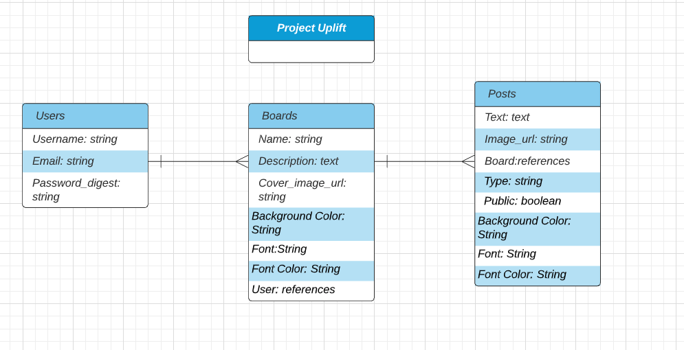

# Project-Uplift
Save your affirmations, celebrate your wins, and count your blessings

## Overview
Project Uplift is a website where users can create boards and text posts of affirmations, celebrations, blessings, and uplifting quotes.  They can share their posts with other users or simply save them on their own boards.

## MVP
Users can create boards and view their own post-boards, create and share post-cards, browse shared posts, save shared posts to their own boards, and edit and delete posts on their own boards.


### Libraries and Dependencies
| **Library**       |  **Description**   |
| :------------------------ | :-- |
| React            | Front End/Render Components |
| React Router              | Link and Route for Components, useParams and useHistory   |
| Axios | API calls to back end   |
| JWT      | User Authentication/Web Tokens |
| bcrypt  | Password hashing and unhashing |

### Client

#### Wireframes


#### Component Tree


#### Component File Structure

```bash
src
├── assets
    ├── fonts
   
├── components 
    ├── Main
    ├── Header
    ├── Nav
    ├── PostDetail Card
├── services
    ├── apiConfig
    ├── users
    ├── boards
    ├── posts
├── layout
    ├── Layout
├── screens
    ├── Home
    ├── Affirmations
    ├── Celebrations
    ├── Blessings
    ├── Wisdom
    ├── User Home
    ├── User Board/s
    ├── PostDetail
    ├── PostCreate
    ├── PostEdit
    ├── SignIn
    ├── SignUp


```

#### Time Estimates
| **Task**       |  **Priority**   | **Estimated Time** | **Time Invested** | **Actual Time**|
| :------------------------ | :-- | :-- | :-- | :-- |
| Models | H | 1 hrs | | |
| Routes | H | 2 hr | | |
| Controllers/Backend CRUD | H | 3 hrs | | |
| Seed Data| M | 2 hrs | | |
| Testing and Debugging Backend | H | 3 hrs | | |
| Home Screen Logic | M | 1hr | | |
| Rendering Shared Posts Screens | H | 2 hrs | | |
| Rendering Post Detail Screen | M | 2hrs | | |
| Rendering User Home | H | 1hr | | |
| Rendering User Boards | H | 2hr | | |
| Edit Post Form & Logic | H | 2hr | | |
| Create Post Form & Logic | H | 2hr | | |
| Sign In & Sign Up Forms | H | 2hr | | |
| User Authentication | H | 3 hr| | |
| Front End CRUD services | H | 3hr | | |
| Testing and Debugging Front End CRUD| H | 2hr | | |
| Styling/CSS | H | 6hr | | |

### Server

#### ERD Model


## Post-MVP
Allow users to make font and background choices for posts.  Allow users to make boards public/private, and allow other users to browse public boards.


